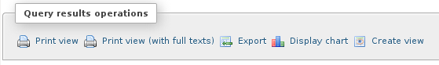
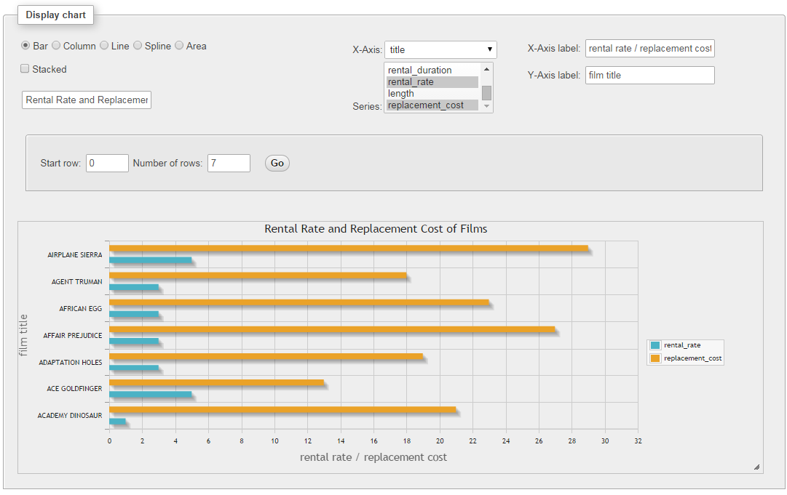
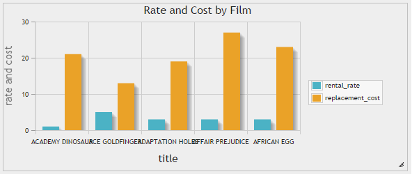
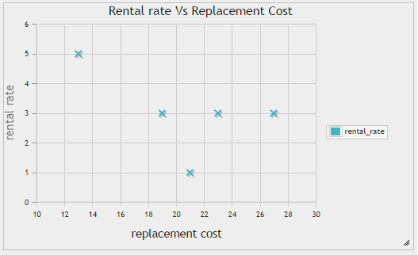
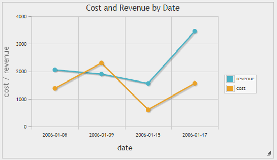
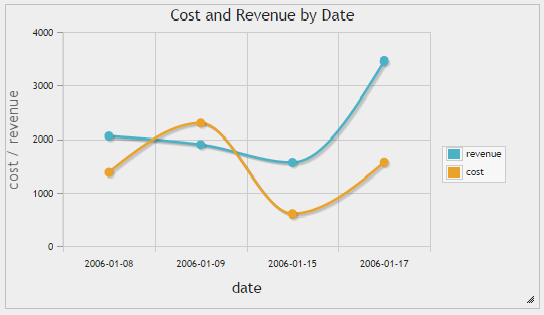
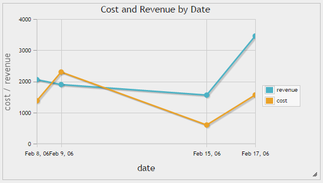

.. _charts:

Charts
======

.. versionadded:: 3.4.0

Since phpMyAdmin version 3.4.0, you can easily generate charts from a SQL query
by clicking the "Display chart" link in the "Query results operations" area.

A window layer "Display chart" is shown in which you can customize the chart with the following options.

-   Chart type: Allows you choose the type of the chart. Supported types are bar charts, column charts, line charts, spline charts, area charts, pie charts and timeline charts (only the chart types applicable for current series selection are offered).
-   X-axis: Allows to choose the field for the main axis.
-   Series: Allows to choose series for the chart. You can choose multiple series.
-   Title: Allows specifying a title for the chart which is displayed above the chart.
-   X-axis and Y-axis labels: Allows specifying labels for axes.
-   Start row and number of rows: Allows generating charts only for a specified number of rows of the results set.

Chart implementation
--------------------

Charts in phpMyAdmin are drawn using `jqPlot <http://www.jqplot.com/>`_ jQuery library.

Examples
--------

Pie chart
+++++++++

Query results for a simple pie chart can be generated with:

.. code-block:: mysql

    SELECT 'Food' AS 'expense', 
       1250 AS 'amount' UNION
    SELECT 'Accommodation', 500 UNION
    SELECT 'Travel', 720 UNION
    SELECT 'Misc', 220

And the result of this query is:

+---------------+--------+
| expense       | anount |
+===============+========+
| Food          | 1250   |
+---------------+--------+
| Accommodation | 500    |
+---------------+--------+
| Travel        | 720    |
+---------------+--------+
| Misc          | 220    |
+---------------+--------+

Choosing expense as the X-axis and amount in series:

.. image:: images/pie_chart.png

Bar and column chart
++++++++++++++++++++

Both bar charts and column chats support stacking. Upon selecting one of these types a checkbox is displayed to select stacking.

Query results for a simple bar or column chart can be generated with:

.. code-block:: mysql

    SELECT 
       'ACADEMY DINOSAUR' AS 'title',
       0.99 AS 'rental_rate',
       20.99 AS 'replacement_cost' UNION
    SELECT 'ACE GOLDFINGER', 4.99, 12.99 UNION
    SELECT 'ADAPTATION HOLES', 2.99, 18.99 UNION
    SELECT 'AFFAIR PREJUDICE', 2.99, 26.99 UNION
    SELECT 'AFRICAN EGG', 2.99, 22.99

And the result of this query is:

+------------------+--------------+-------------------+
| title            | rental_rate  | replacement_cost  |
+==================+==============+===================+
| ACADEMY DINOSAUR | 0.99         | 20.99             |
+------------------+--------------+-------------------+
| ACE GOLDFINGER   | 4.99         | 12.99             |
+------------------+--------------+-------------------+
| ADAPTATION HOLES | 2.99         | 18.99             |
+------------------+--------------+-------------------+
| AFFAIR PREJUDICE | 2.99         | 26.99             |
+------------------+--------------+-------------------+
| AFRICAN EGG      | 2.99         | 22.99             |
+------------------+--------------+-------------------+

Choosing title as the X-axis and rental_rate and replacement_cost as series:

Scatter chart
+++++++++++++

Scatter charts are useful in identifying the movement of one or more variable(s) compared to another variable.

Using the same data set from bar and column charts section and choosing replacement_cost as the X-axis and rental_rate in series:

Line, spline and timeline charts
++++++++++++++++++++++++++++++++

These charts can be used to illustrate trends in underlying data. Spline charts draw smooth lines while timeline charts draw X-axis taking the distances between the dates/time into consideration.

Query results for a simple line, spline or timeline chart can be generated with:

.. code-block:: mysql

    SELECT 
       DATE('2006-01-08') AS 'date', 
       2056 AS 'revenue',
       1378 AS 'cost' UNION
    SELECT DATE('2006-01-09'), 1898, 2301 UNION
    SELECT DATE('2006-01-15'), 1560, 600 UNION
    SELECT DATE('2006-01-17'), 3457, 1565

And the result of this query is:

+------------+---------+------+
| date       | revenue | cost |
+============+=========+======+
| 2016-01-08 | 2056    | 1378 |
+------------+---------+------+
| 2006-01-09 | 1898    | 2301 |
+------------+---------+------+
| 2006-01-15 | 1560    | 600  |
+------------+---------+------+
| 2006-01-17 | 3457    | 1565 |
+------------+---------+------+

