# Creating, Exporting, and Importing your First Database and Table

Below are steps to create, export, and import your first simple database and table. With Apache and MySQL modules both started, navigate to <a>http://localhost/phpmyadmin/ </a> via Chrome, Firefox, Safari, or Edge

#

### <b><u>Creating a Simple Database and Table in phpMyAdmin</b></u>

<ol>

<li> In the crossbar at the top of the window, click "Databases. You may also click "New" in the pullout menu on the left side of the screen.
<ul> If you do not see "Databases," expand the size of the window, click "More", or click on the three vertically-stacked horizontal lines to access more commands.</ul>

<kbd><kbd>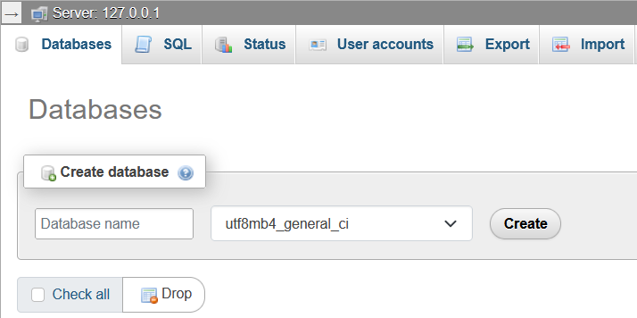</kbd></kbd>

<code>The "Databases" tab is where you can create new databases</code>
</li>

<li> Specify a name for your database. In this example, we will use test_guide. Leave the character set to default at utf8mb4_general_ci. <code>This is most common as most characters are specified by unicode value</code>.
</li>

<li> Click the "Create" button to create the database.

<li> Now, we must create a table for this database. For this example, we will create a table with the name "classes" and the number of columns set to 4.

<kbd><kbd>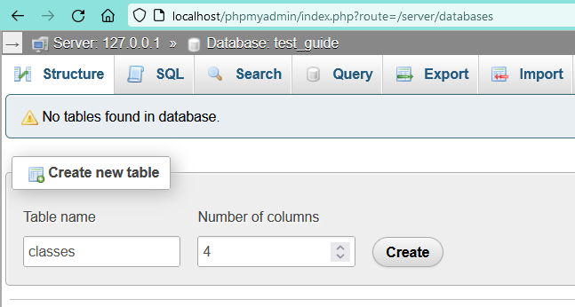</kbd></kbd>

<code>When creating a new table, you must give the table a name and specify some number of columns</code></li>

<li>You are then taken to the table's details and attributes. We can set the values and options for each column of the table. Notice that we may scroll horizontally to see more options.</li>

<li> In the first row, we will set the name to "class_id", type as "INT", length/values as "6", and we will check the A_I (auto_increment) box.</li>

<li> In the second row, we will set the name to "class_name", type as "VARCHAR", length/values as "45".</li>

<li> In the third row, we will set the name to "class_description", type as "TEXT".</li>

<li> In the fourth row, we will set the name to "class_grade", type as "CHAR", length/values as "1", default as NULL, and we will ensure that the Null box is checked.</li>

<li> Lastly, in the "Table comments" box, we will type "My first table!"</li>

<li> Your screen should look similar to below. 
<kbd><kbd>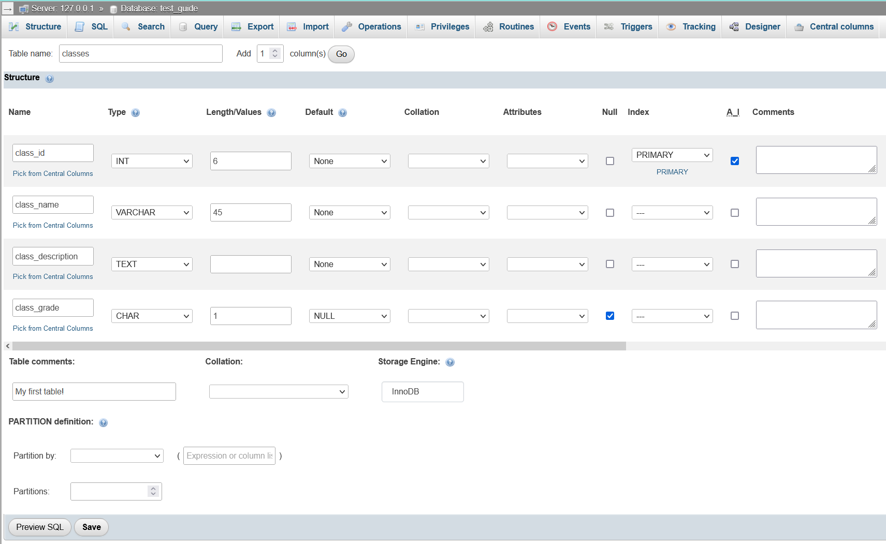</kbd></kbd>

<code>After specify the number of columns in the table, you may specify additional attributes for the table</code> </li>

<li> Click on the Preview SQL button to see the syntax that will be used to create the table. It should match as follows: <ul><code>CREATE TABLE `test_guide`.`classes` (`class_id` INT(6) NOT NULL AUTO_INCREMENT , `class_name` VARCHAR(45) NOT NULL , `class_description` TEXT NOT NULL , `class_grade` CHAR(1) NULL DEFAULT NULL , PRIMARY KEY (`class_id`)) ENGINE = InnoDB COMMENT = 'My first table!'; </code></ul>

<li> Save the table.</li>

<li> After saving the table, you will notice that you are now in the "Structure" tab of phpMyAdmin. Here, you may modify your tables, browse data within the tables, and more. You may always verify your location in phpMyAdmin at the very top of the screen. 
<kbd><kbd>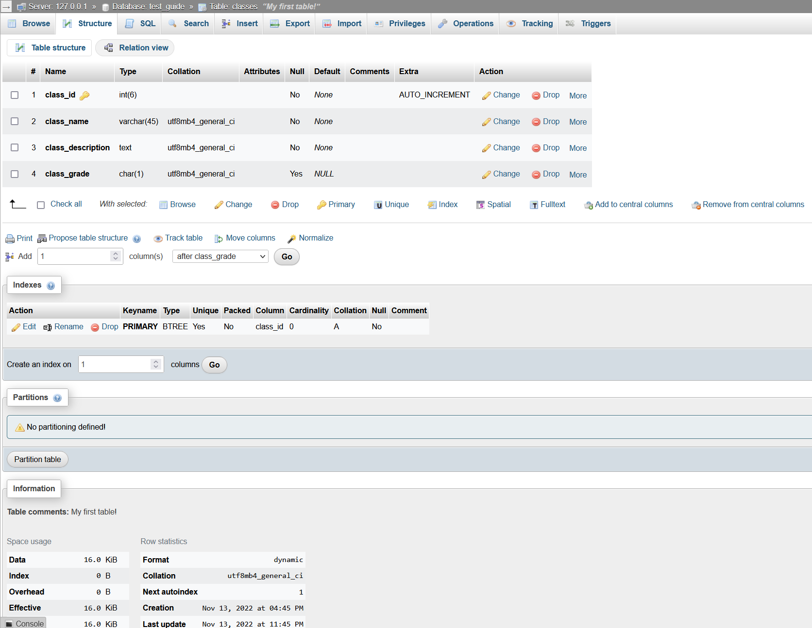</kbd></kbd>

<code> After saving the table, you will be taken to the "Structure" tab </code>

<li> Let's return to the database. At the very top of the screen, click on "Database: test_guide"

<kbd><kbd>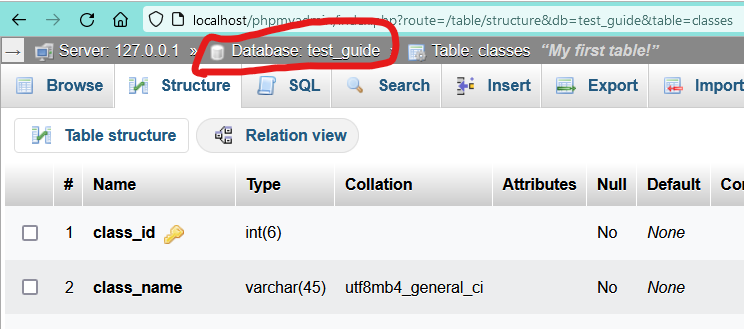</kbd></kbd>

<code>The top of phpMyAdmin shows your current location</code>

<li> We can view the tables we have created in Designer mode. Click "Designer" on the crossbar at the top of the screen. Remember to expand your screen, click on the three vertically-stacked horizontal lines, or click "More" if you do not see it. 
<kbd><kbd>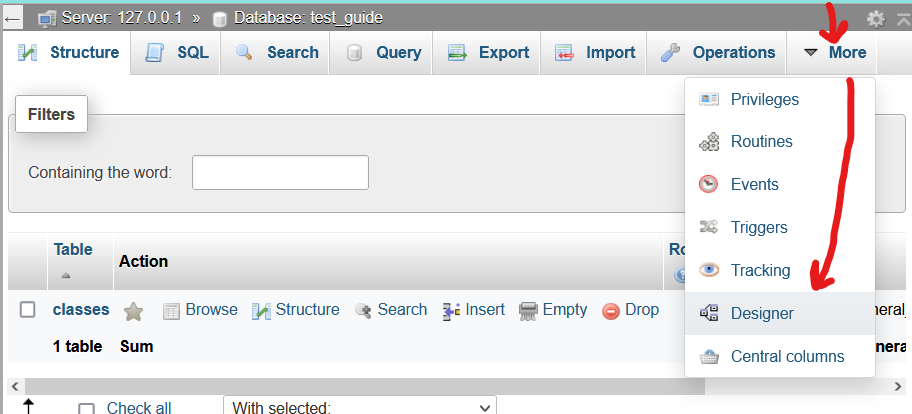</kbd></kbd>

<code>If the screen is too condensed, you can reach the "Designer" tab through the "More" dropdown</code>

<li> In designer mode, you may visualize the setup of the tables that make up your database. You may export schemas, create pages, add other tables from other databases, and more via the menu on the lefthand side of the canvas.
<kbd><kbd>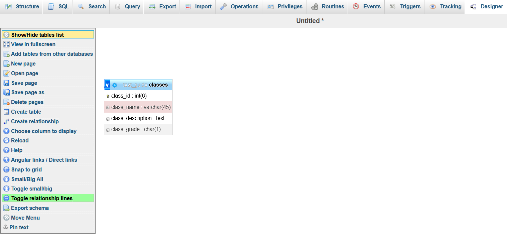</kbd></kbd>

<code>Visualize your tables in your databases in the Designer tab, with more options to the left</code></li>

<li> Success! We have created our first database and table. We know how to:
<ul><code> - Find where we are in phpMyAdmin </code> (very top of the screen)</ul>
<ul><code> - Create a database </code> (click "New" on left side of screen, or navigate to "Databases" in top menu crossbar)</ul>
<ul><code> - Create a table </code> (while a database is selected, click "Structure" and specify table name and number of columns on the bottom of the screen. You may also click "New" on the left pullout menu underneath our selected database)</ul>
<ul><code> - Modify a table </code> (while a database is selected, click "Structure" and then click on the subsection "Structure" of the table of choice)</ul>
</ol>

#

### <b><u>Exporting a Database in phpMyAdmin</b></u>

Exporting databases is simple and widely customizable.

<ol>
<li> In the top menu crossbar, click Export. <code> Similarly, you may first click on the database you'd like to export, and then click on Export. </code></li>
<li> Under "Export method", click "Custom." You will see several customizable options for export.</li>
<li> In the next field, for now, leave the format as SQL. </li>
<li> Ensure that only our "test_guide" database is selected under "Databases"</li>
<li> Under "Output", rename the file as you see fit. For this example, we will rename it as the name of the database, "test_guide". Ensure that "Use this for future exports" is NOT selected, else all future databases will be renamed test_guide unless otherwise specified.</li>
<li> Feel free to examine the rest of the options. For now, we will scroll down and export the database. Click Export. </li>
<li> The database will have been exported as a SQL file on the Desktop. Go ahead and open up the test_guide.SQL file in a text editor to see what has been exported!
<kbd><kbd>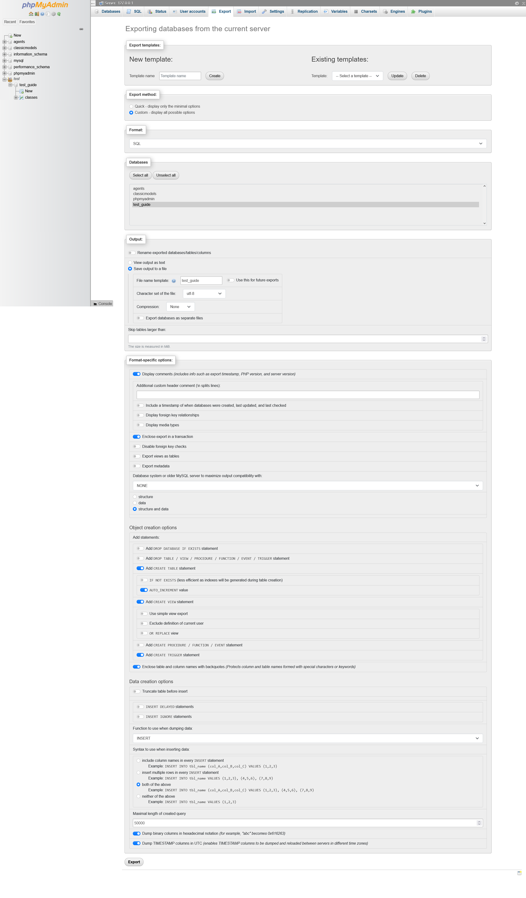</kbd></kbd>

<code>There are numerous options you may specify when exporting your databases</code>
</ol>

### <b><u>Importing a Database in phpMyAdmin</b></u>

Let's begin by dropping the test_guide database. Don't worry, we've already saved a copy to our desktop. Then, we'll reimport the database back into phpMyAdmin.

<ol>
<li> Select the test_guide database in the left menu pullout. Ensure that the database was selected by checking our current location at the very top of the screen.
<kbd><kbd>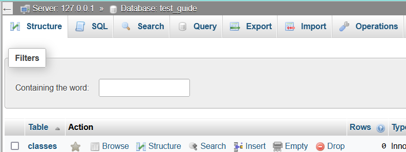</kbd></kbd>

<code>You may drop tables from the "Structure" tab, or drop databases in the "Operations" tab</code></li>
<li> In the top menu crossbar, click "Operations." <code> This area provides options for modifying the database.</code></li>
<li> Toward the middle of the screen under "Remove Database", locate and click on "Drop the database (DROP)" in red letters. Confirm that you would like to drop the database. 
<kbd><kbd>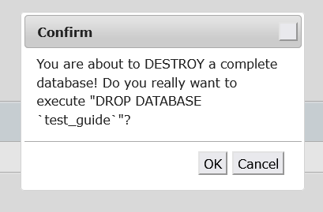</kbd></kbd>

<code>A confirmation popup ensures you would like to drop the database</code></li>
<li> In the top menu crossbar, click "Import."</li>
<li> Browse for and select the test_guide.SQL file that was created on your desktop. </li>
<li> At the bottom of the screen, click "Import"</li>
<li> You will see that the screen has populated with queries to import the SQL file. We have imported our test_guide.SQL database!
<kbd><kbd>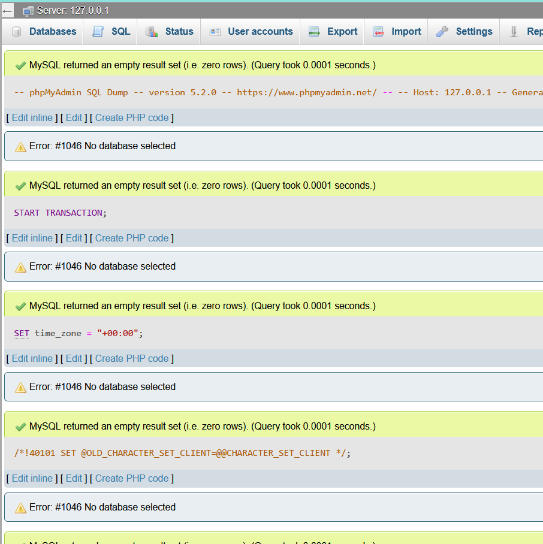</kbd></kbd>

<code>The result of the import is displayed. Errors would also be displayed</code></li>
</ol>
