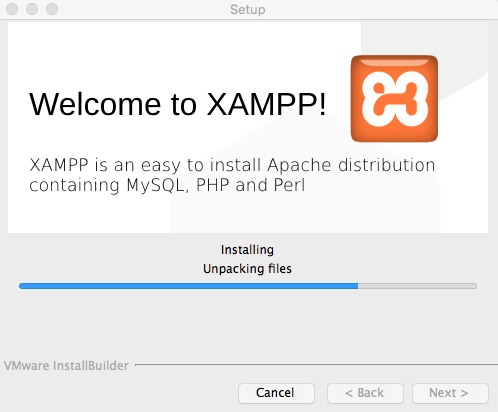
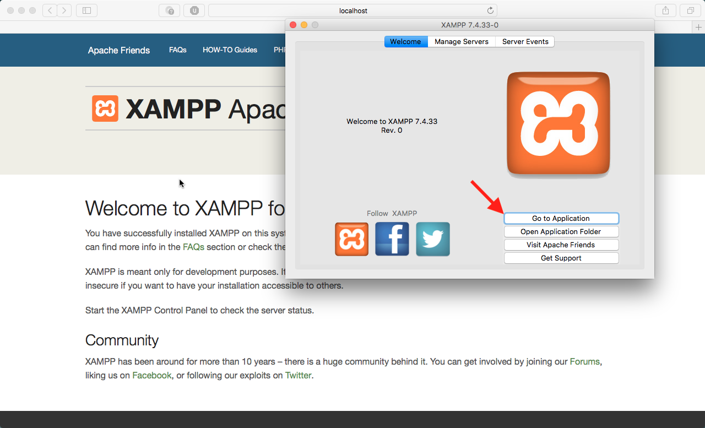
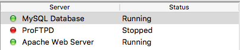
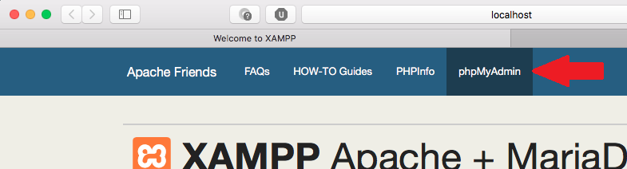
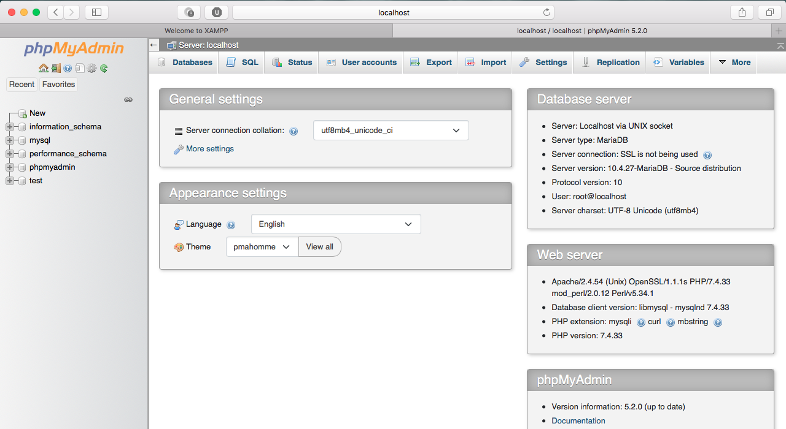

# OS X Setup Guide

Below are the steps for installing, running, using, stopping, and uninstalling phpMyAdmin on Mac OS X operating systems.

## <b><u>Installing and Running</b></u>

### Installing Apache and phpMyAdmin

<ol>
<li> 
      Navigate to <a>https://www.apachefriends.org/download.html</a> to download Apache. Choose the latest release. 
      </li>
      <li> 
      Run the installation for Apache. 
      </li>
      <ul>
      Sometimes, Mac OS X prevents installation of installers. To circumvent, hold the "control" button on your keyboard, click the installer once, and then click "Open"
      </ul> 
</li>
<li> 
      Complete the installation. 
</li>
      
<kbd><kbd>
      </kbd></kbd>

      
<code>Apache installation contents</code>

</ol>

### Running Apache and phpMyAdmin

<ol>
<li>
      Launch the XAMPP application. The XAMPP Control Panel will open, and you may notice that your default browser opens to <a>http://localhost/</a>. If the web browser did not open, then click the "Go to Application" button in the XAMPP application.
</li>
      
<kbd><kbd>
      </kbd></kbd>

      
<code>Apache Control Panel layout</code>

<li>
      From the XAMPP Control Panel, click the "Manage Servers" tab and "Start" the MySQL Database Server. A green light with the text, "Running" will indicate that the server is running properly.
</li>
<ul>
      You may also configure the MySQL server here by clicking the "Configure" button. 
</ul>
      
<kbd><kbd>
      </kbd></kbd>

      
<code>XAMPP Manage Servers screen</code>

      
<kbd><kbd>
      </kbd></kbd>

      
<code>XAMPP Manage Servers screen with MySQL server running</code>

<li>
      To start phpMyAdmin, you may click on phpMyAdmin from the splash page that XAMPP had previously opened.
</li>
<ul>
      Alternatively, you may open either Chrome, Firefox, Safari, or Edge, and navigate to <a>http://localhost/</a>.
</ul>
      
<kbd><kbd>
      </kbd></kbd>

      
<code>Click on phpMyAdmin from the XAMPP splash screen to open phpMyAdmin</code>

<li>
You have successfully opened phpMyAdmin. Your screen should look similar to below:
</li>
      
<kbd><kbd>
      </kbd></kbd>

      
<code>The phpMyAdmin software running in the browser screen</code>

<li>
To stop using phpMyAdmin, first "Stop" the MySQL and Apache Web Server modules in the XAMPP Control Panel. Then, you may close XAMPP Control Panel.
</li>

</ol>
