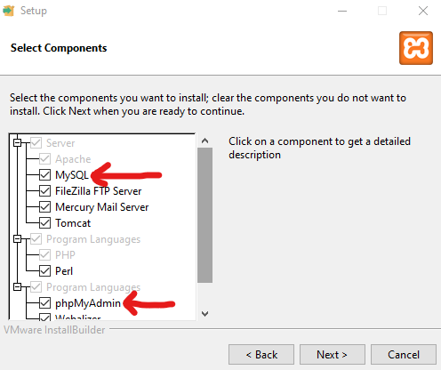
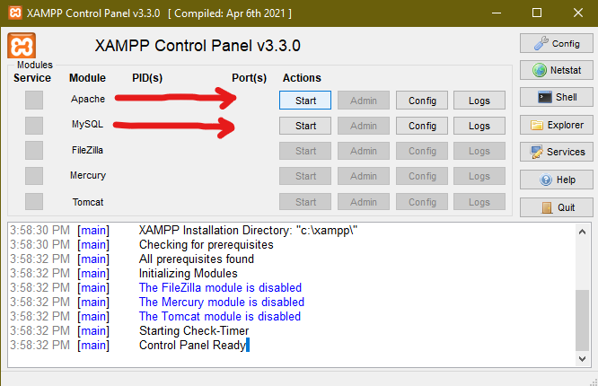
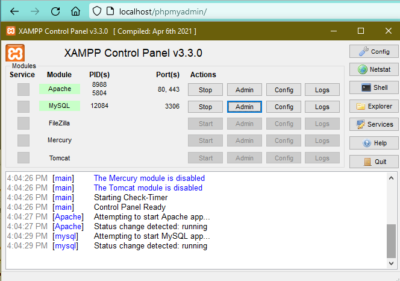
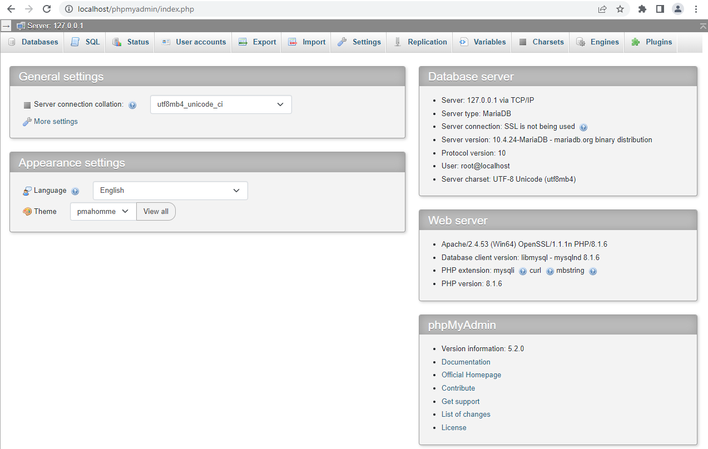

# Windows Setup Guide

Below are the steps for installing, running, using, stopping, and uninstalling phpMyAdmin on Windows operating systems.

## <b><u>Installing and Running</b></u>

### Installing Apache and phpMyAdmin

<ol>
      <li> Navigate to <a>https://www.apachefriends.org/download.html</a> to download Apache. Choose the latest release. </li>
      <li> Run the installation for Apache. </li>
      <li> Ensure that MySQL and phpMyAdmin are selected for installation.
      

      <kbd><kbd></kbd></kbd>
      

      

      <code>Ensure that MySQL and phpMyAdmin are checked during installation of Apache's XAMPP Control Panel</code>
      

      </li>
      <li> Finish installation. </li>
</ol>

### Running Apache and phpMyAdmin

<ol>
      <li> Run the XAMPP application </li>
      <li> Click the "Start" button under "Actions" for both the Apache and MySQL modules
      

      <kbd><kbd></kbd></kbd>
      

      

      <code>XAMPP Control Panel. Start the Apache and MySQL modules to run phpMyAdmin</code>
      

      </li>
      <code>This will run phpMyAdmin locally at 127.0.0.1. You may change this by clicking Config > phpMyAdmin (config.inc.php) for the Apache module </code>
      <li> To start phpMyAdmin, open either Chrome, Firefox, Safari, or Edge, and navigate to <a>http://localhost/phpmyadmin/ </a>. </li>
      <ul>Also, you may click on the "Admin" button under "Actions" for the MySQL module to access phpMyAdmin.
        
<kbd><kbd></kbd></kbd>

<code>Access phpMyAdmin by clicking the "Admin" action button under the MySQL Module</code></ul>
      <li> You have successfully opened phpMyAdmin. Your screen should look similar to below: 
<kbd><kbd></kbd></kbd>

<code>A running instance of phpMyAdmin</code>
      <li>To stop using phpMyAdmin, first "Stop" the MySQL and Apache modules in the XAMPP Control Panel. Then, you may close XAMPP Control Panel.</li>
</ol>
