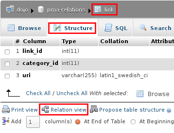
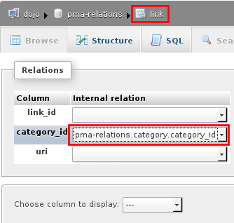
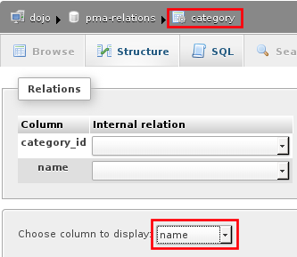
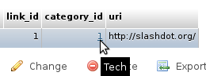

.. _relations:

Relations
=========

phpMyAdmin allows relationships (similar to foreign keys) using MySQL-native
(InnoDB) methods when available and falling back on special phpMyAdmin-only
features when needed. There are two ways of editing these relations, with the
*relation view* and the drag-and-drop *designer* -- both of which are explained
on this page.

.. note:: 

    You need to have configured the :ref:`linked-tables` for using phpMyAdmin
    only relations.

Technical info
--------------

Currently the only MySQL table type that natively supports relationships is
InnoDB. When using an InnoDB table, phpMyAdmin will create real InnoDB
relations which will be enforced by MySQL no matter which application accesses
the database. In the case of any other table type, phpMyAdmin enforces the
relations internally and those relations are not applied to any other
application.

Relation view
-------------

In order to get it working, you first have to properly create the
[[pmadb|pmadb]]. Once that is setup, select a table's "Structure" page. Below
the table definition, a link called "Relation view" is shown. If you click that
link, a page will be shown that offers you to create a link to another table
for any (most) fields. Only PRIMARY KEYS are shown there, so if the field you
are referring to is not shown, you most likely are doing something wrong.  The
drop-down at the bottom is the field which will be used as the name for a
record.

Relation view example
+++++++++++++++++++++

Let's say you have categories and links and one category can contain several links. Your table structure would be something like this:

-   `category.category_id` (must be unique)
-   `category.name`
-   `link.link_id`
-   `link.category_id`
-   `link.uri`.

Open the relation view (below the table structure) page for the `link` table and for `category_id` field, you select `category.category_id` as master record.

If you now browse the link table, the `category_id` field will be a clickable hyperlink to the proper category record. But all you see is just the `category_id`, not the name of the category.

To fix this, open the relation view of the `category` table and in the drop down at the bottom, select "name". If you now browse the link table again and hover the mouse over the `category_id` hyperlink, the value from the related category will be shown as tooltip.

Designer
--------

The Designer feature is a graphical way of creating, editing, and displaying
phpMyAdmin relations. These relations are compatible with those created in
phpMyAdmin's relation view.

To use this feature, you need a properly configured :ref:`linked-tables` and
must have the :config:option:`$cfg['Servers'][$i]['table_coords']` configured.

To use the designer, select a database's structure page, then look for the
:guilabel:`Designer` tab.

To export the view into PDF, you have to create PDF pages first. The Designer
creates the layout, how the tables shall be displayed. To finally export the
view, you have to create this with a PDF page and select your layout, which you
have created with the designer.

.. seealso::

    :ref:`faqpdf`
