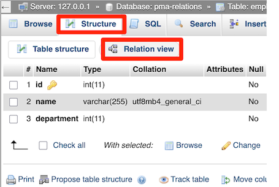
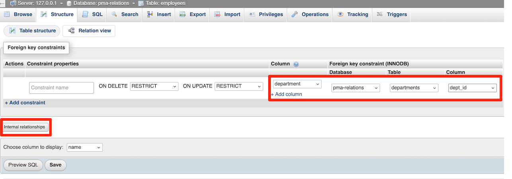
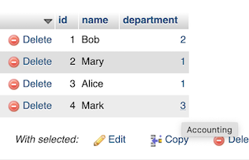
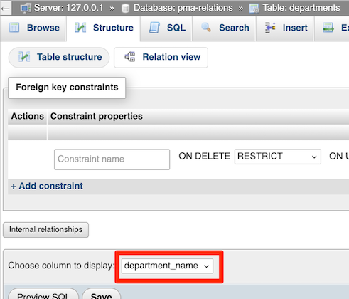
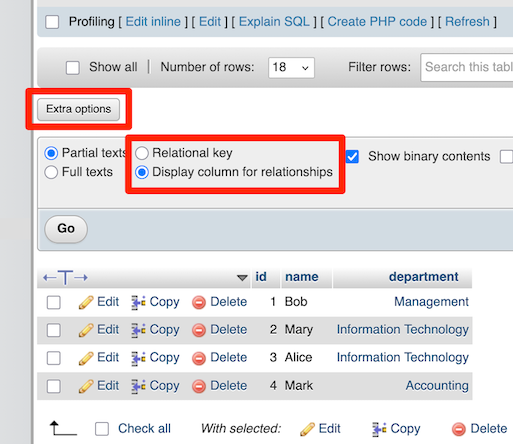
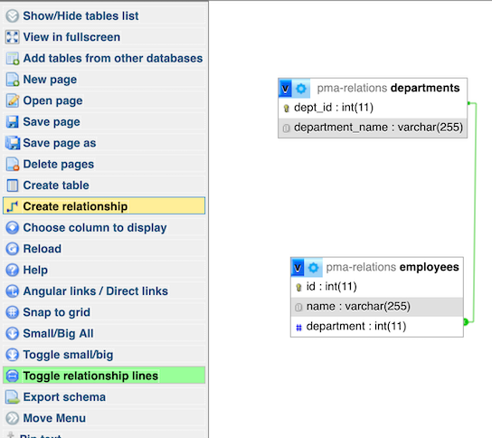

.. _relations:

Relations
=========

phpMyAdmin allows relationships (similar to foreign keys) using MySQL-native
(InnoDB) methods when available and falling back on special phpMyAdmin-only
features when needed. There are two ways of editing these relations, with the
*relation view* and the drag-and-drop *designer* -- both of which are explained
on this page.

.. note::

    You need to have configured the :ref:`linked-tables` for using phpMyAdmin
    only relations.

Technical info
--------------

Currently the only MySQL table type that natively supports relationships is
InnoDB. When using an InnoDB table, phpMyAdmin will create real InnoDB
relations which will be enforced by MySQL no matter which application accesses
the database. In the case of any other table type, phpMyAdmin enforces the
relations internally and those relations are not applied to any other
application.

Relation view
-------------

In order to get it working, you first have to properly create the
:ref:`linked-tables`. Once that is setup, select a table's "Structure" page. Below
the table definition, a link called "Relation view" is shown. If you click that
link, a page will be shown that offers you to create a link to another table
for any (most) fields. Only PRIMARY KEYS are shown there, so if the field you
are referring to is not shown, you most likely are doing something wrong.  The
drop-down at the bottom is the field which will be used as the name for a
record.

Relation view example
+++++++++++++++++++++

Let's say you have a database with employees and their departments. Your table structure would be something like this:

-   ``employees.id`` (must be unique)
-   ``employees.name``
-   ``employees.department``
-   ``departments.dept_id``
-   ``departments.department_name``

Each employee belongs to only one department, but each department has many employees.
Of course you might also have fields in ``employees`` for things like email address and office number as well as
a third table for current projects or supervisor or any of many other possible details.

From the ``employees`` table :guilabel:`Structure` tab, open the :guilabel:`Relation view` (just below the menu bar). Select the ``department`` column
as the column to work with and ``departments`` table ``dept_id`` column as that is the referenced key.
We recommend using the native constraints where possible, but there is an :guilabel:`Internal relationships` area for usage when
the table type does not support these natively.

If you now browse the ``employees`` table, the ``department`` field will be a clickable hyperlink to the proper category record. It will still show the
``dept_id`` instead of the label. A tooltip appears when hovering over the values with the referenced label.

To further improve this, open the :guilabel:`Relation view` of the ``departments`` table and in the drop down at the bottom, select
``department_name`` (in some cases, this may already be the default setting).

Go back to the :guilabel:`Browse view` for the ``employees`` table and expand the :guilabel:`Extra options` then select
:guilabel:`Display column for relationships`. This shows the text from the referenced table instead of the integer value.

This preference can be set in :config:option:`$cfg['RelationalDisplay']` or the user preferences.

Designer
--------

The Designer feature is a graphical way of creating, editing, and displaying
phpMyAdmin relations. These relations are compatible with those created in
phpMyAdmin's relation view.

To use this feature, you need a properly configured :ref:`linked-tables` and
must have the :config:option:`$cfg['Servers'][$i]['table_coords']` configured.

To use the designer, select a database's structure page, then look for the
:guilabel:`Designer` tab.

You can also export this window, which can be handy to visually reference the database structure.
To export the view into PDF, you have to create PDF pages first. The Designer
creates the layout, how the tables shall be displayed. To finally export the
view, you have to create this with a PDF page and select your layout, which you
have created with the designer.

.. seealso::

    :ref:`faqpdf`
